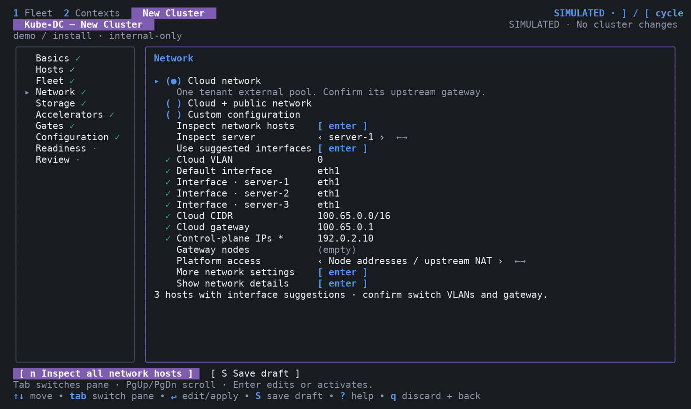

# Choose an installation network layout

Use this guide to configure **New Cluster → Network** before you install
Kube-DC. Choose the tenant network, then choose how clients reach the platform.
The form generates the install `.env` input. It does not configure physical
switches, create host bonds, or change host routes during discovery.

## Before you begin

Get the following information from your network operator:

- The carrier interface on each server and the switch ports connected to it.
- The cloud network VLAN, CIDR, gateway, and reserved addresses.
- The same values for a public tenant network, if required.
- The control-plane internal IPs and eligible gateway node names.
- The platform address, DNS records, and firewall rules. For BGP, also get the
  local ASN, peer ASN, and peer address.

Keep management access available when an existing interface joins OVS.
Shared management links need a persistent host configuration and a recovery
path. Discovery cannot verify the physical switch configuration.

## Select one tenant network

Use Enter or Space to select one radio button:

| Choice | Use when | Generated preset |
|---|---|---|
| Cloud network | Projects use one external address pool, normally private. An upstream gateway provides Internet access when required. | `cloud-vlan` |
| Cloud + public network | Projects also need a provider-routed public pool on a second VLAN of the same trunk. | `cloud+public-vlan` |
| Custom configuration | You maintain the complete environment and review the selected Fleet layers. | `custom` |

An imported `internal-only` preset appears as **Cloud network** and keeps its
stored name. Its generated network defaults match `cloud-vlan`. It does not
add a no-egress policy or remove the provider network.

The following physical patterns use these choices:

| Physical pattern | Configuration | Interface guidance |
|---|---|---|
| Dedicated, untagged NIC | Cloud VLAN `0`; carrier such as `ens5` | An unused link can be a candidate. Confirm which provider segment reaches it. |
| Dedicated tagged trunk | Switch VLAN ID; carrier such as `eno2` | Enter the parent carrier. Kube-OVN applies the VLAN in OVS. |
| Existing bond | Switch VLAN ID; carrier such as `bond0` | Prepare the bond first. Do not select a member NIC. |
| Shared management and tenant trunk | Reviewed host network configuration plus the correct parent carrier | Explicit selection only. Moving the carrier into OVS can affect SSH and boot-time addressing. |
| Different NIC names across servers | Default interface plus **Interface · SERVER** overrides | Each override becomes a ProviderNetwork `customInterfaces` entry. |
| Cloud and public VLANs | Two VLANs and address plans on one carrier | Reserve router, host, VIP, and anchor addresses before tenant allocation. |

VLAN `0` means **untagged**. A provider's virtual network identifier is not
necessarily an 802.1Q tag inside its VMs.

## Inspect and map interfaces

1. In Hosts, enter each Kubernetes node name, SSH target, and verified host key.
2. In Network, select **Inspect network hosts**, or press `n`. The CLI reads
   at most four hosts at once through pinned SSH connections.
3. Select **Use suggested interfaces** if it appears. The action maps hosts
   with exactly one unused, up Ethernet interface or bond. It leaves ambiguous
   hosts for manual selection and keeps mappings for other hosts.
4. Review **Default interface** and each **Interface · SERVER** row. An empty
   override uses the default interface. Confirm the mapping against cabling
   and switch configuration.
5. Select **Show network details** to see addresses, MTU, routes, link ownership,
   and individual choices. A link with addresses or routes requires explicit
   review. Bond members, VLAN child interfaces, and virtual links receive no
   automatic proposal.
6. Enter the VLAN, CIDR, gateway, control-plane IPs, and gateway nodes. Use
   **More network settings** for MTU, reservations, anchors, and private endpoints.
7. Inspect again after changing a mapping. Save the input and review it before
   installation.

Discovery reads detailed links and IPv4 routes from all routing tables. It also
reads IPv4 and IPv6 interface addresses. Results expire after five minutes.
Changing a host key or SSH target invalidates its proposals. Discovery does not
prove that an address is free, that a switch carries a VLAN, or that the full
path supports the observed NIC MTU.

## Choose platform access separately

**Platform access** selects who owns the address used by platform clients.
Envoy uses the host network in all three modes:

| Choice | Required network conditions | Installation output |
|---|---|---|
| Node addresses / upstream NAT | DNS reaches the ingress nodes directly, or through a separately configured upstream NAT rule. | `INGRESS_ADDRESS_LAYER=none`; no public ingress VIP layer |
| Floating VIP (L2) | A reserved VIP and a shared L2 segment reachable by the eligible ingress nodes. | `metallb-l2`; MetalLB address pool and L2 advertisement |
| Routed VIP (BGP) | A reserved VIP and router peering configured with the supplied ASNs and peer address. | `metallb-bgp`; MetalLB address pool, peer, and BGP advertisement |

A BGP platform VIP does not convert tenant EIP/FIP networks into routed-only
networks. Tenant external gateways still need their configured provider path.
An L2 interface selector does not limit MetalLB leader election by itself;
eligible nodes must also have the interface. See
[MetalLB interface and node selection](https://metallb.io/configuration/_advanced_l2_configuration/).

For a VIP, ingress nodes must be gateway nodes. Leave **Ingress nodes** empty
to use the gateway set, or enter a reviewed subset under **More network
settings**. Avoid a mix of control-plane and worker ingress nodes: the
management API listener has different port ownership on those roles.

For an L2 VIP in the public pool, the generator can propose public anchor
addresses next to the VIP and reserve them in tenant IPAM. Confirm that the
whole range is allocated to this cluster. These are calculated addresses,
not addresses verified as free. The host-facing public anchor is an OVS
internal port; do not create a competing Linux VLAN interface on the same tag.

## Review site-specific settings

The following features need more than an interface suggestion:

| Feature | Inputs and additional work |
|---|---|
| Cloud anchors | `EXT_NET_ANCHOR_IPS`, interface, required flag, gateway nodes, and reserved addresses. Anchors alone do not enable Internet NAT. |
| Node-based egress NAT | Explicit `EXT_NET_NODE_EGRESS_ENABLED=true`, complete anchors, upstream routing, and host forwarding/NAT design. The default stays `false`. |
| Host default route on public anchors | Explicit public host-IP mapping and `EXT_NET_PUBLIC_ANCHOR_DEFAULT_ROUTE=true`. Requires a host migration and recovery plan. |
| Private platform endpoints | API/ingress VIPs, enable flags, endpoint overlays, DNS, reservations, and both global allowlists. The form preserves values; it does not reproduce custom sibling overlays. |
| Pod, Service, join, and infra ranges | Review together in Configuration. Existing RKE2 address ranges must agree with the generated platform values. |
| Datacenter VLAN attachments | A separate post-install feature with fabric allocation and tenant authorization. See [physical VLAN attachments](tenant-vlan-attachment.md). |
| Project routed networks | A separate post-install feature with managed routing gateways and explicit import/export policy. See [routed networks](routed-networks.md). This BGP feature is independent of MetalLB. |

Use **Configuration** for all other supported environment keys. An explicit
pattern change resets its owned network defaults. A platform-access change
resets the previous address mode's fields and derived Service shape. Unchanged
imports retain their overrides so validation can report conflicts.

## Verify the result

Before confirming installation, check the generated environment and plan for
the selected preset, per-node NICs, VLANs, address pools, reservations, and
platform access. The installer renders these values through the existing
network and ingress generators.

After installation, verify ProviderNetwork readiness on every intended node,
tenant DNS and egress, platform HTTPS from an external client, and the expected
source address. Test reboot recovery and VIP failover before relying on a
shared carrier or redundant ingress. A successful render does not qualify
those live network paths.

Continue with the [installation guide](installation-guide.md).
