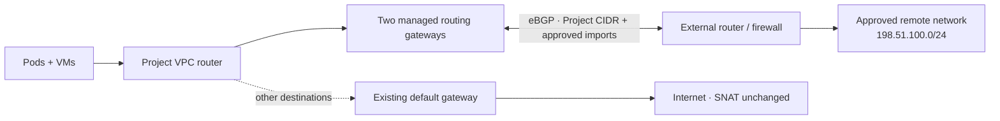

import RoutedNetworkDiagram from '@site/src/components/Diagram/RoutedNetworkDiagram';

# Operating Routed Networks

Routed Networks connect an entire Project VPC to approved external IPv4
destinations through platform-managed eBGP gateways. They are for corporate
LANs, physical services, and other routed domains that are not the Internet.

This is deliberately different from a [Datacenter VLAN](tenant-vlan-attachment.md):

| | Routed Network | Datacenter VLAN |
|---|---|---|
| Relationship | L3 route for the whole Project | L2 NIC on selected workloads |
| Tenant action | Attach the Project | Attach each pod or VM |
| BGP | Platform-managed FRR | None |
| Default route | Unchanged | Unchanged |

<details data-github-only>
<summary>Diagram source for GitHub</summary>



</details>

<RoutedNetworkDiagram />

Routed Networks are an alpha feature and are disabled by default. The chart
installs their additive CRDs, but the manager registers no watches, admission
handler, or data-plane reconciliation until the feature gate is enabled and all
four CRDs are discoverable.

## Security and traffic contract

- The platform owns the fabric, peer addresses, ASNs, authentication, and
  import/export policy.
- An Organization administrator may attach only an allocation delegated to
  that Organization, and only to one of its Projects.
- Exports are derived from the authoritative Project VPC CIDR. Tenants cannot
  supply an advertised prefix or FRR configuration.
- Imports are explicit. `0.0.0.0/0` and any Project, node, Service, platform,
  transit, or routing-link prefix are rejected.
- A shared routing domain requires non-overlapping Project CIDRs.
- v1 is `routed-egress`: Project-initiated flows and their replies are allowed;
  externally initiated sessions and Project transit are denied by nftables.
- The Project's existing Internet/CGNAT default route is never changed.

For every approved destination, the controller installs a Kube-OVN
`PolicyRoute{action: drop}` backstop before changing steering. OVN policy
routes precede static routes, so the controller removes that drop only after
healthy steering is durable. If both FRR gateways fail, it re-installs the drop
before withdrawing steering; the destination cannot fall through to the
Internet gateway.

## Prerequisites

Before creating a fabric, verify:

1. The existing Kube-OVN `ProviderNetwork` is Ready on at least two nodes.
2. The switch trunks the chosen transit VLAN to those nodes.
3. The external router owns the transit gateway address and is configured for
   the declared peer ASN.
4. The transit CIDR is dedicated to routing gateways. Size it for two addresses
   per attached Project, plus the external router and network reservations.
5. Imported destinations do not overlap any platform or tenant range.
6. The external routing domain has a non-overlapping prefix for every Project
   that will attach.
7. At least two eligible nodes can satisfy required anti-affinity.
8. Every eligible node permits the namespaced but unsafe
   `net.ipv4.ip_forward` pod sysctl. For RKE2, pass
   `kubelet-arg: ["allowed-unsafe-sysctls=net.ipv4.ip_forward"]` in the node
   config and restart RKE2 before enabling the feature. The gateway
   deliberately fails startup when its pod network namespace cannot forward
   IPv4.

Use documentation ranges in examples and source control. Never commit a real
peer address or TCP-MD5 password to a public repository.

## Enable the feature

Set the chart value only on the intended validation or production cluster:

```yaml
routedNetwork:
  enabled: true
  backend: frr-project-gateway
  namespace: kube-dc-routing
  gatewayImage: shalb/kube-dc-routing-gateway:v0.1.6
  frrImage: quay.io/frrouting/frr:10.4.1
  routingLinkPool: 100.65.0.0/16
```

The corresponding manager environment gate is
`ROUTED_NETWORK_ENABLED=true`. The chart requires redundant manager replicas
when the gate is on and creates the privileged `kube-dc-routing` namespace,
RBAC, webhook, sibling ValidatingAdmissionPolicy, and retained CRDs.

:::danger
Do not enable only the manager environment variable. Ship the chart first so
all four CRDs and the admission configuration exist. A manager watching a
missing CRD exits, which can also take unrelated fail-closed webhooks down.
:::

Gate OFF is intentionally inert: no routed controller or webhook is registered,
no gateway is created, and no VPC route is programmed.

## Create a RoutingFabric

A fabric describes one provider VLAN and its platform-owned BGP policy.

```yaml
apiVersion: kube-dc.com/v1
kind: RoutingFabric
metadata:
  name: corporate-edge
spec:
  driver: frr-project-gateway
  providerNetwork: ext-cloud
  vlanId: 2000
  transit:
    cidrBlock: 192.0.2.0/29
    gateway: 192.0.2.1
    excludeIps:
      - 192.0.2.1
  bgp:
    localASN: 65002
    peers:
      - address: 192.0.2.1
        asn: 65001
    timers:
      keepalive: 3
      hold: 9
    bfd:
      enabled: false
      minRx: 300
      minTx: 300
      multiplier: 3
  routingDomain:
    mode: shared
  nodeSelector:
    matchLabels:
      network.kube-dc.com/routing: "true"
  highAvailability:
    replicas: 2
```

If the peer requires TCP-MD5, create a Secret named by
`spec.bgp.authenticationSecretRef.name` in `kube-dc-routing`. Its required key is
`password`. Supply it through the installation's secret-management workflow;
do not put the value in the CR, a ConfigMap, shell history, or Git. The
controller injects it only into a mode-0600 runtime FRR file.

```bash
kubectl get routingfabric corporate-edge
kubectl get routingfabric corporate-edge \
  -o jsonpath='{.status.phase}{"\t"}{.status.transitAddressesFree}{"\n"}'
kubectl get routingfabric corporate-edge \
  -o jsonpath='{range .status.conditions[*]}{.type}{"="}{.status}{" "}{.reason}{"\n"}{end}'
```

`Ready` requires the provider network and the selected nodes to be available.
The controller creates a provider VLAN, transit Subnet, and NAD. Do not create
aliases for those generated objects.

## Allocate policy to an Organization

Create the allocation from **Infrastructure → Routed Networks**, or apply a
platform-owned manifest:

```yaml
apiVersion: kube-dc.com/v1
kind: RoutedNetworkAllocation
metadata:
  name: corporate-services
spec:
  fabricRef: corporate-edge
  organization: acme
  importPolicy:
    allowedPrefixes:
      - 198.51.100.0/24
    matchMode: exact-or-more-specific
    minPrefixLength: 24
    maxPrefixLength: 28
    maxPrefixes: 100
    allowDefaultRoute: false
  exportPolicy:
    mode: project-vpc-cidrs
    maxPrefixes: 16
  sharing:
    mode: multiple-projects
```

An empty `allowedPrefixes` list means import nothing. It is safe and valid. A
default route is not a shortcut for “all corporate networks”; enumerate the
destinations that the Organization is allowed to reach.

```bash
kubectl get routednetworkallocation corporate-services
kubectl get routednetworkallocation corporate-services \
  -o jsonpath='{.status.phase}{"\t"}{.status.attachedProjects}{"\n"}'
```

Allocation names are the Organization-facing handles. `fabricRef` and
`organization` are immutable. Delete and recreate an unused allocation to move
it to another Organization.

## Attachment lifecycle

Organization administrators attach from **Organization → Networks → Routed
Networks**. The request is a `ProjectRouteAttachment` in the Project backing
namespace:

```yaml
apiVersion: kube-dc.com/v1
kind: ProjectRouteAttachment
metadata:
  name: corporate
  namespace: acme-production
spec:
  allocationRef: corporate-services
  direction: routed-egress
```

The ordered controller pipeline is:

1. revalidate allocation ownership, sharing, and all prefix collisions;
2. reserve two transit addresses and one hidden routing-link `/29` atomically;
3. create the Project routing link and controller-owned FRR/nftables config;
4. create two hardened gateway replicas in `kube-dc-routing`;
5. wait until every configured BGP peer is Established on a replica;
6. install destination drop backstops;
7. merge healthy next-hop steering into the existing VPC route slices and
   disarm the now-shadowing transition drop; and
8. publish attachment and gateway status.

Generated gateways have two interfaces: `eth0` is the hidden Project-VPC
routing link and `net1` is the provider transit VLAN. They run without a service
account token, with no privilege escalation, and only `NET_ADMIN`/`NET_RAW`.
Required anti-affinity, topology spread, a PodDisruptionBudget, SecurityGroup,
and nftables provide defense in depth.

### HA and BFD

The two gateway replicas both establish eBGP. Stateful `routed-egress` uses
deterministic active/standby forwarding: the lowest allocated gateway is the
VPC next hop, and per-replica MED 0/100/... is derived from that pod's observed
routing-link address rather than its independently allocated transit address.
The external router therefore selects the same return path even when the two
IP pools assign replicas in different orders. When that session fails, the
manager and peer promote the next healthy replica. This keeps
established-return nftables enforcement valid without sharing conntrack state
between pods.

The pinned two-capability gateway runtime runs `bgpd` without `zebra`/`bfdd`.
Even when BFD is requested, status therefore reports `degraded-no-bfd` and
failover follows the BGP hold timer plus exporter readiness. The FRR generator
and API retain BFD configuration for a future qualified runtime, but operators
must never report BFD as active until both the peer and Kube-OVN next-hop path
are proven live.

## Inspect operation

```bash
kubectl -n acme-production get projectrouteattachment corporate -o yaml
kubectl -n acme-production get projectroutinggateway
kubectl -n kube-dc-routing get deploy,pod,pdb \
  -l network.kube-dc.com/project-namespace=acme-production

# Platform-only peer and policy inspection
POD=$(kubectl -n kube-dc-routing get pod \
  -l network.kube-dc.com/project-namespace=acme-production \
  -o jsonpath='{.items[0].metadata.name}')
kubectl -n kube-dc-routing exec "$POD" -- vtysh -c 'show bgp ipv4 unicast summary'
kubectl -n kube-dc-routing exec "$POD" -- vtysh -c 'show route-map'
```

The controller records `Ready`, `PolicyValid`, `Redundant`, `BgpEstablished`,
`RoutesProgrammed`, and `FailClosedArmed`. A healthy two-replica attachment is
`Ready`; one replica is `Degraded` but available; zero replicas means steering
is withdrawn while the drop remains.

The main-only Grafana dashboard has UID `kube-dc-routed-networks`. Alerts are:

- `BGPPeerDown`, `BGPAllPeersDown`, `BGPRouteFlapping`
- `BGPMaxPrefixExceeded`, `BGPUnexpectedRoute`, `RouteLeakDetected`
- `RoutingGatewayReplicaDown`, `RoutingGatewayNoRedundancy`
- `RoutingFabricUnavailable`, `ProjectRouteProgrammingFailed`
- `TransitAddressExhausted`

Organization notifications use only `organization`, `project`, and
`routed_network`; peer and provider topology remain platform-only.

Audit Events include `RoutedNetworkAllocated`, `ProjectRouteAttached`,
`ProjectRouteDetached`, `ImportPolicyChanged`, `BGPPeerChanged`, and
`RoutePolicyViolation`. Events carry bounded old/new state; authenticated actor
and full old/new request data come from the Kubernetes audit log.

## Prove the admission boundary

Use server-side dry-run with the tenant identity you intend to grant. These
checks must fail for a Project administrator and for cross-Organization use:

```bash
kubectl create -f attachment.yaml --dry-run=server \
  --as=project-admin@example.test \
  --as-group=acme:project-admin

kubectl create -f attachment.yaml --dry-run=server \
  --as=org-admin@example.test \
  --as-group=another-org:org-admin
```

An `acme:org-admin` request may create/delete its own attachment but receives no
`update` or `patch` permission. The sibling ValidatingAdmissionPolicy also
protects generated gateways, Deployments, PDBs, NADs, Secrets, ConfigMaps,
SecurityGroups, Subnets, and the shared VPC route slices. Do not weaken or merge
it into the unrelated identity-boundary policy.

## Drain and delete

Delete the attachment before reclaiming its allocation or fabric. Teardown is
fail closed and intentionally takes several reconciles:

1. install the drop backstop before removing healthy steering;
2. scale gateways to zero and wait for pods to disappear;
3. delete owned config, security, and routing-link resources;
4. release the atomic address claim;
5. remove the drop last; and
6. remove the finalizer.

Never force-remove the finalizer during ordinary operation. If emergency
recovery requires it, inspect and remove the exact UID-owned VPC routes and
generated resources first; otherwise stale forwarding state or an address
collision can survive the API object.

Disable the feature only after every `ProjectRouteAttachment`,
`RoutedNetworkAllocation`, `ProjectRoutingGateway`, and `RoutingFabric` has
completed deletion.

## Troubleshooting

| Symptom | Check |
|---|---|
| Fabric `Unavailable` | ProviderNetwork ready nodes, node selector, VLAN trunk, transit Subnet |
| Attachment `PolicyInvalid` | Organization ownership, sharing mode, exact collision message |
| Pods running but not Ready | `vtysh` summary, peer ASN/address, VLAN reachability, MD5, timers |
| Pod rejected with `SysctlForbidden` | add `net.ipv4.ip_forward` to each eligible kubelet's `allowedUnsafeSysctls`, then restart kubelet |
| One ready replica | anti-affinity capacity, failed pod, BGP state; routing should remain available |
| No ready replicas | confirm steering is absent and `FailClosedArmed=True` before debugging the peer |
| Unexpected routes | inspect rejected-route metric and peer export; never broaden the import list reflexively |
| Internet changed | treat as a routing incident: the controller must never own `0.0.0.0/0` |
| Address exhaustion | reclaim unused attachments or expand the fabric transit CIDR through a planned replacement |

Do not hand-edit generated FRR, nftables, VPC routes, or gateway workloads.
Reconciliation restores the declared policy, and manual route edits can break
the ordering that makes failure safe.
