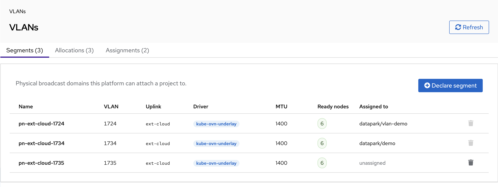
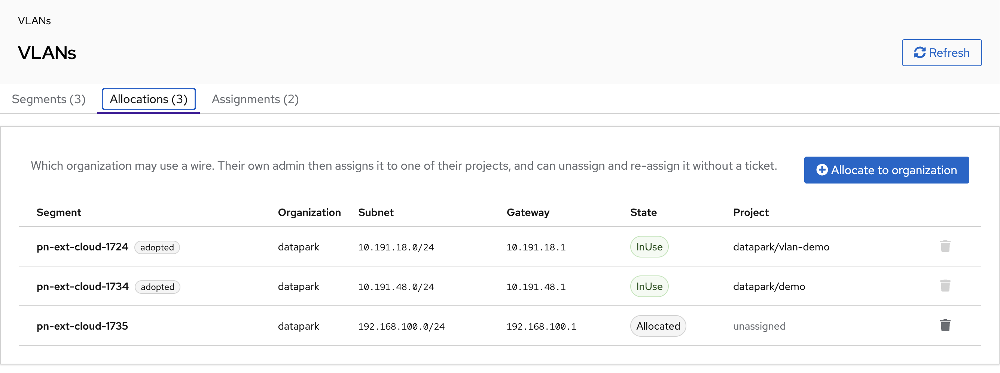
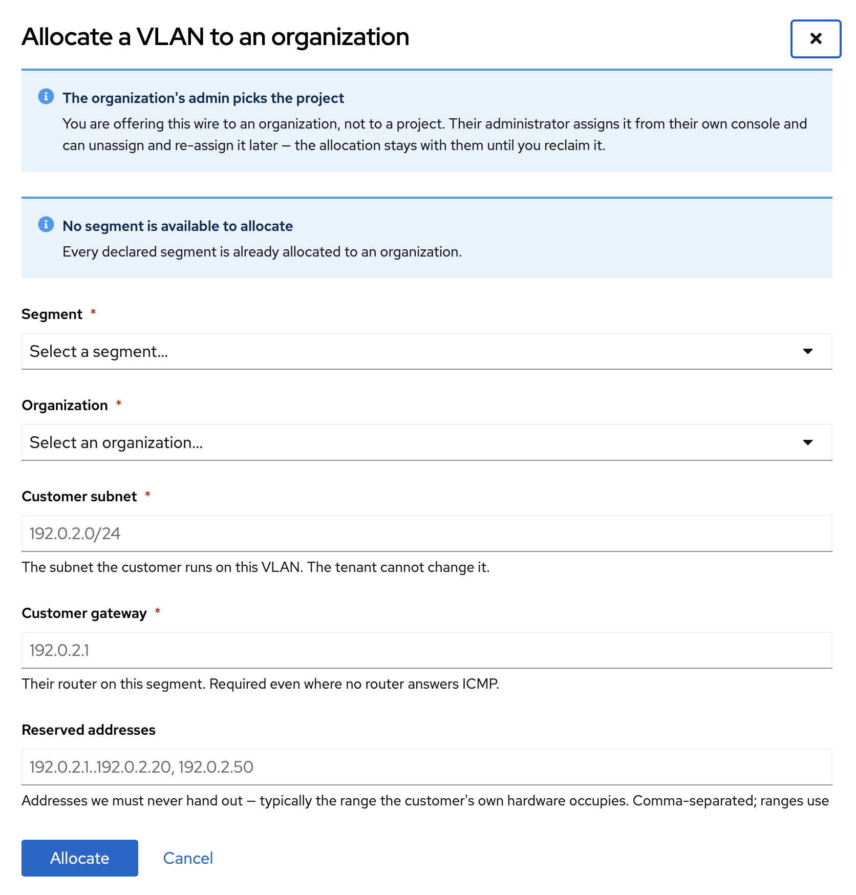

# Tenant attachment to a physical VLAN

Kube-DC can put a tenant's workloads on a customer-owned physical VLAN, so they
are layer-2 adjacent to that customer's own hardware while their default route
stays on the tenant VPC interface.

There are two things to operate here, and keeping them apart is the whole point:

- **The wire.** A `FabricSegment` is one physical broadcast domain — one
  `(ProviderNetwork, VLAN id)` pair. You declare it once, after the switch really
  delivers the tag to the nodes.
- **Who may use it.** A `FabricSegmentAllocation` offers that wire to one
  **organization**. Their own admin then binds it to one of their **projects**,
  and can unassign and re-bind it without involving you.

```
   FabricSegment          FabricSegmentAllocation        ProjectNetwork
   (the wire)             (which org may use it)         (which project holds it)
   ───────────────        ───────────────────────        ────────────────────────
   platform admin    ──►  platform admin            ──►  ORG ADMIN, reversibly
   pn-ext-4014            org: acme                      project: production
```

The user-facing half of this is documented in
[Datacenter VLANs](/cloud/datacenter-vlans) on the tenant docs.

---

## Supported slice

Deliberately narrow. Anything outside this is refused at admission:

- `FabricSegment.spec.driver: kube-ovn-underlay`
- `ProjectNetwork.spec.mode: l2`
- a real IPv4 gateway on the customer segment
- no logical gateway, U2O interconnection, custom-VPC routing, or live VMI hotplug
- controller-assigned IP/MAC/route state; tenant Multus runtime overrides and
  provider-scoped IPAM overrides are refused
- the reserved segment may be attached only through the generated NAD, never as a
  workload or Namespace primary `logical_switch`
- **one project per physical broadcast domain**, and one organization per wire

## Enabling the feature

The chart installs the additive CRDs (`FabricSegment`, `FabricSegmentAllocation`,
`ProjectNetwork`, `VlanReservation`) on every cluster. The controller and its
fail-closed webhooks stay inactive until both fleet values are set:

```dotenv
PROJECT_NETWORK_ENABLED=true
KUBE_DC_MANAGER_REPLICAS=2
```

The chart refuses to render with one manager replica or with the manager webhook
server disabled. The attachment gate is fail-closed on the pod path, so a single
replica would make every rollout or drain an outage for VLAN-attached workloads.
The two replicas are spread across distinct nodes and protected by a
PodDisruptionBudget.

:::danger
Do not set `PROJECT_NETWORK_ENABLED` back to `false` while a ProjectNetwork
exists. A live Helm/Flux upgrade and the manager both fail closed on that
transition. Delete every binding, wait for its drain-first teardown, then disable.
:::

---

## Prerequisites

Confirm all of the following before declaring a segment:

1. The physical switch delivers the VLAN tag to every selected Kubernetes node.
2. The existing Kube-OVN `ProviderNetwork` is Ready on those nodes.
3. The customer has **explicitly delegated an address range** on that segment to
   Kube-DC, and everything outside it is listed in `excludeIps`. Reserve more
   than the addresses currently pingable: DHCP pools, HA/floating addresses,
   documented reservations and any range the customer plans to grow into. Kube-DC
   allocates freely from whatever you leave open, and a collision lands on
   equipment you do not operate and cannot see.
4. The VLAN CIDR does **not overlap** the tenant's project VPC subnet, nor any
   other VLAN the same project holds. Nothing validates this today — an overlap
   produces ambiguous connected routes inside the workload and is very hard to
   diagnose from the outside.
5. The VLAN is dedicated to one Kube-DC project. A second project on the same
   broadcast domain is refused even under another Subnet or NAD name.
6. At least two schedulable manager nodes are available.
7. If a tenant will attach one workload to several VLANs, at least one node
   carries **all** of them. Admission adds a required node constraint per VLAN and
   Kubernetes ANDs them, so disjoint ready-node sets leave the pod unschedulable.

:::warning
Never reuse a platform external VLAN such as `ext-cloud` or `ext-public`. Obtain a
dedicated VLAN from the datacenter network team.
:::

---

## Step 1 — declare the physical segment

The name is deterministic. For the underlay driver it must be
`pn-<providerNetwork>-<vlanId>`, because **the name is the isolation key**: two
segments describing one wire collide in etcd rather than racing an admission
check.

```yaml
apiVersion: kube-dc.com/v1
kind: FabricSegment
metadata:
  name: pn-ext-4014
spec:
  driver: kube-ovn-underlay
  providerNetwork: ext
  vlanId: 4014
  mtu: 1400
  nodeSelector:
    matchLabels:
      network.kube-dc.com/customer-vlan-4014: "true"
```

Label only nodes where the switch really delivers that VLAN. A node can have the
OVS bridge up on its uplink and still receive no frames for this tag.

```bash
kubectl get fabricsegment pn-ext-4014 \
  -o jsonpath='{.status.ready}{"\t"}{.status.readyNodes}{"\t"}{.status.foreignObjects}{"\n"}'
```

`status.ready` must be `true`, `readyNodes` must match the intended nodes, and
`foreignObjects` must be empty. `foreignObjects` lists kube-ovn objects sitting on
this wire that Kube-DC did not create — an alias Subnet or duplicate Vlan can
bridge a second tenant onto the same broadcast domain, so it blocks admission.

Segments and their allocations are visible under **Infrastructure → VLANs** in
the admin console.



---

## Step 2 — allocate the wire to an organization

This is what delegates day-to-day assignment to the tenant. Use **Infrastructure →
VLANs → Allocations → Allocate to organization**.





Or by manifest:

```yaml
apiVersion: kube-dc.com/v1
kind: FabricSegmentAllocation
metadata:
  name: pn-ext-4014          # MUST equal the FabricSegment name
spec:
  org: acme
  network:
    cidrBlock: 192.0.2.0/24
    gateway: 192.0.2.1
    gatewayCheck: false
    excludeIps:
      - 192.0.2.1..192.0.2.99
```

Two things about this object are load-bearing:

**Its name is the segment name.** There is no `segmentRef` field, and adding one
would be a regression. Naming the allocation after the wire makes "one
organization per broadcast domain" an atomic property of storage — a second
allocation collides with `AlreadyExists`. A `segmentRef` field plus a uniqueness
check in admission is a read-then-write race: two concurrent passes each list,
each see no conflict, and both proceed.

**The addressing lives here, not on the tenant's binding.** These are physical
facts about the customer's segment, and admission requires a tenant-created
`ProjectNetwork` to match them exactly. Without that, an org admin — who holds
`create` on `ProjectNetwork` — could bind their allocated wire with a CIDR
covering the customer's entire subnet, a gateway pointing at their own workload,
or empty `excludeIps` that lets IPAM hand out addresses the customer's hardware
already uses.

`spec.network` stays editable while the wire is unassigned, so a mistyped gateway
is a patch rather than a rebuild. An existing binding copied the values at
creation and is unaffected.

```bash
kubectl get fabricsegmentallocation
# NAME          ORG    PHASE       PROJECT   SEGMENT READY   AGE
# pn-ext-4014   acme   Allocated             true            2m
```

| Phase | Meaning |
|---|---|
| `Allocated` | The organization holds it; no project has taken it. |
| `InUse` | A project holds it. |
| `Releasing` | The binding is draining. Not yet re-assignable. |

---

## Step 3 — the tenant binds a project

Nothing for you to do. The organization's admin assigns and unassigns from their
own console, as described in [Datacenter VLANs](/cloud/datacenter-vlans).

The controller claims the segment with a `VlanReservation`, creates the Kube-OVN
Vlan and Subnet, and publishes the NAD last. Do not create or edit those generated
objects by hand.

```bash
kubectl get projectnetwork
kubectl get vlanreservation pn-ext-4014 -o yaml
kubectl -n acme-production get network-attachment-definition
```

### Binding directly, as the platform admin

You can still create a `ProjectNetwork` yourself — for a cluster where nobody has
delegated yet, or to reproduce a tenant's problem:

```yaml
apiVersion: kube-dc.com/v1
kind: ProjectNetwork
metadata:
  name: customer-storage
spec:
  org: acme
  project: production
  segmentRef: pn-ext-4014
  mode: l2
  cidrBlock: 192.0.2.0/24
  gateway: 192.0.2.1
  gatewayCheck: false
  excludeIps:
    - 192.0.2.1..192.0.2.99
```

A platform admin may bind without an allocation existing. The controller then
**adopts** one — recording which organization holds the wire, copying the
addressing off the binding. That is how clusters that predate this feature
converge with no migration step and no operator action.

Adoption only ever creates; it never rewrites an allocation that disagrees, and it
only adopts a binding that already holds the segment's `VlanReservation`. Both
restrictions exist so a binding cannot re-home a wire behind your back.

---

## Security model

Delegation means tenants hold cluster-scoped verbs on `ProjectNetwork`. RBAC
cannot express "only your own organization" for a cluster-scoped kind, so **RBAC
is only a coarse gate and admission is the real boundary**.

### The tenant ClusterRole

`kube-dc:projectnetwork-tenant` grants exactly `create` and `delete`, bound
per-organization to the group `<org>:org-admin`. Do not add verbs to it.

- **No `update`/`patch`.** Every `ProjectNetworkSpec` field is immutable, so a
  tenant UPDATE can only touch metadata — including the controller's teardown
  finalizer. Strip that and delete, and the binding disappears *without draining*:
  the NAD and reservation go while a workload's Multus interface is still on the
  wire, the allocation reads free, and the next assignment puts two projects on
  one L2 segment. The webhook denies tenant UPDATEs independently, but do not rely
  on that alone.
- **No `get`.** Binding names are predictable (`<segment>-<project>`) and
  admission cannot filter a read at all, so a cluster-scoped `get` would let any
  org admin read another organization's project names, subnets and gateways.

The cost is that tenants can `kubectl create -f` and `kubectl delete <name>` but
not `apply` or `get`; the console serves their reads, filtered.

### What admission enforces

On `ProjectNetwork` CREATE / UPDATE / DELETE:

1. the caller is a platform admin, or carries `<spec.org>:org-admin`;
2. the live `Organization` UID matches the one pinned on the allocation;
3. an allocation exists for the segment, is not being reclaimed, and names that org;
4. the binding's addressing matches the allocation exactly;
5. the project exists in that organization;
6. the segment is not already bound;
7. no tenant UPDATE, ever.

Identity comes from `AdmissionRequest.UserInfo.Groups`, which the API server
derives from the authenticated token. Per-organization OIDC stamps the realm name
onto every group, so `acme:org-admin` can only be issued by the `acme` realm — a
tenant cannot mint a group naming somebody else's organization.

DELETE is validated too, and this is easy to miss: a cluster-scoped `delete` takes
a *name*, and other orgs' binding names are guessable. Without the rule, any org
admin could tear down any other organization's VLAN grant.

### Organization names are not identities

Names are reusable. Delete `acme`, create it again for a different customer, and
the new realm mints the identical `acme:org-admin`. The controller therefore pins
the `Organization` UID in `status.orgUid` and admission compares the live UID
against it.

On mismatch the allocation is marked stale and the pin is **not** rewritten —
re-pinning is exactly the silent hand-over being prevented. Re-allocate
explicitly. The console shows a warning icon on such a row.

### Limits worth knowing

- **In-cluster ServiceAccounts cannot assign VLANs.** Authorization derives from
  the realm-prefixed OIDC group, which only human org admins carry. GitOps driven
  from inside a project namespace cannot bind a wire; assignment is a human,
  audited action.
- **Anyone holding `impersonate` on groups can forge `<org>:org-admin`.** That is
  cluster-admin territory and no tenant role grants it, but the group check is
  exactly as strong as the set of principals allowed to impersonate.
- **Deleting the CRD** removes stored allocations without per-object admission.

---

## Reclaiming a wire

Deleting an allocation is refused while a project still holds it, both at
admission and by a finalizer — so the refusal survives a webhook outage or a
`--force` delete.

```bash
kubectl delete fabricsegmentallocation pn-ext-4014
# Error from server (Forbidden): admission webhook
# "vfabricsegmentallocation.kube-dc.com" denied the request:
# tenant-VLAN attachment denied: allocation "pn-ext-4014" is still assigned to
# project "production"; unassign it and let the wire drain first
```

Ask the tenant to unassign, or delete the `ProjectNetwork` yourself, wait for
teardown, then reclaim. In the console, **Reclaim** is disabled while a project
holds the wire and the tooltip names that project.

---

## Teardown

Delete the `ProjectNetwork` — never its NAD, Subnet, Vlan, or reservation.
Teardown enters `Denying`, refuses new attachments, and waits for a stable zero of
attachment intent. It then confirms, in order, that the NAD, Kube-OVN Subnet
(including its finalizer) and controller-owned Vlan are gone before releasing the
reservation.

```bash
kubectl delete projectnetwork customer-storage
kubectl get projectnetwork,vlanreservation
```

If deletion waits, remove the pods and VMs that still declare the NAD, and inspect
`kubectl get ips.kubeovn.io -o yaml` for allocations whose `spec.subnet` or
`spec.attachSubnets` names the generated Subnet. Teardown waits for both declared
intent and realised Kube-OVN allocations. **Do not remove the finalizer.**

Delete the `FabricSegment` only after the reservation is released and the
`ProjectNetwork` is gone.

### Orphaned reservations

A `VlanReservation` whose owning `ProjectNetwork` no longer exists blocks every
future binding of that wire *and* blocks deleting the segment — and the fabric
guard correctly refuses a reservation delete from anyone but the controller, so it
cannot be cleared by hand.

The controller reaps such a claim automatically, but **only when the wire is
genuinely quiesced**. On reconcile it compares the reservation's owner UID against
live `ProjectNetwork`s and, if the owner is gone, additionally confirms that
teardown's own artifacts — the published NAD and the generated Kube-OVN Subnet —
are absent before releasing anything.

That second check is the important one. A `ProjectNetwork` can disappear *without*
its drain-first teardown ever running: force-remove the finalizer and the object
goes while its NAD, its Subnet and every attached interface survive. Releasing the
reservation there would turn a stuck wire (fail-safe) into a re-assignable one
(fail-open), and the next binding would put a second project onto a broadcast
domain that still carries the first project's workloads.

```
reaping orphaned VlanReservation: owner gone and teardown artifacts confirmed absent
```

If instead you see this, the wire is quarantined on purpose:

```
NOT reaping VlanReservation: its owner is gone but teardown artifacts remain —
the wire may still carry workloads
```

Do not clear it by hand. Find what is still attached, remove it, and let the
remaining NAD and Subnet go; the reaper then releases the claim on its next pass.

:::danger
Never force-remove a `ProjectNetwork` finalizer. It is what makes teardown
drain-first, and skipping it is the one way to leave live interfaces on a wire the
platform believes is free.
:::

If a wire seems permanently stuck, check for a reservation with no matching
binding before doing anything more invasive:

```bash
kubectl get vlanreservation -o custom-columns=\
'NAME:.metadata.name,OWNER:.spec.owner.name,UID:.spec.owner.uid'
kubectl get projectnetwork -o custom-columns='NAME:.metadata.name,UID:.metadata.uid'
```

---

## Attaching workloads

Tenant-facing detail is in [Datacenter VLANs](/cloud/datacenter-vlans). What
matters operationally:

Admission injects required node affinity and provider-scoped port security,
re-deriving usable nodes from **live** Node and ProviderNetwork state — so a stale
`FabricSegment.status.readyNodes` cannot authorize a black-holed placement. For
VMs this happens on the generated `virt-launcher` Pod, not on the
`VirtualMachine` object.

A live Pod/VMI attachment set is immutable. Recreate the Pod, or stop the VM and
update its template, so admission and CNI run in order. Live VMI network hotplug
to a new tenant VLAN is refused, and live migration is not supported for
VLAN-attached VMs.

Refusals name which of three problems occurred — another project's namespace, a
VLAN not assigned to this project (listing the ones that are), or genuinely
unsupported custom networking — so a tenant ticket usually answers itself.

---

## Acceptance

### A runnable smoke test

Use a diagnostic image — `busybox` lacks `ip -br` and `ping -M do`.

```bash
NS=acme-production
NET=pn-ext-4014-production          # the binding/NAD name

kubectl run vlan-check -n "$NS" --restart=Never --image=nicolaka/netshoot   --overrides="{\"metadata\":{\"annotations\":{\"k8s.v1.cni.cncf.io/networks\":\"$NS/$NET\"}}}"   --command -- sleep 3600

kubectl wait --for=condition=Ready pod/vlan-check -n "$NS" --timeout=120s

# which interface actually carries the VLAN
kubectl get pod vlan-check -n "$NS"   -o jsonpath='{.metadata.annotations.k8s\.v1\.cni\.cncf\.io/network-status}'

# reachability and MTU (substitute the interface from above)
kubectl exec -n "$NS" vlan-check -- ip -4 -br addr
kubectl exec -n "$NS" vlan-check -- ping -c3 -I net1 192.0.2.1
kubectl exec -n "$NS" vlan-check -- ping -c1 -M do -s 1372 -I net1 192.0.2.1   # passes
kubectl exec -n "$NS" vlan-check -- ping -c1 -M do -s 1500 -I net1 192.0.2.1   # fails

kubectl delete pod vlan-check -n "$NS"
```

Repeat on a second VLAN-capable node with `--overrides` adding a `nodeName`, to
prove cross-node traffic on the segment.

:::warning
Delete the test pod before unassigning the wire. Teardown blocks on any remaining
attachment intent, and a leftover pod will look like a stuck unassign.
:::

### Full checklist

Before presenting the feature as operational on a cluster, prove all of these:

- a pod and a VM attach and communicate across two different VLAN-capable nodes;
- an MTU-sized DF packet succeeds and a larger one fails as expected;
- a pod pinned outside the segment's ready nodes is denied;
- another project cannot reference the NAD, an alias Subnet, a conflist provider,
  or a direct logical-switch selector;
- an owner workload cannot select the reserved Subnet as its primary switch or
  supply its own Multus/provider IP, MAC, route or default-route values;
- removing the network annotation from a live Pod/VMI is denied;
- a second `ProjectNetwork` cannot claim the segment, and a direct
  `VlanReservation` mutation or deletion is denied;
- **an org admin cannot bind a segment allocated to another organization, delete
  another organization's binding, allocate a wire to themselves, alter the
  addressing, or bind a wire that is already held;**
- **unassign followed by re-assign to a different project succeeds, and the
  allocation survives both;**
- ordinary pods with no secondary network still admit while the webhooks are on;
- a manager rollout preserves at least one webhook endpoint;
- no U2O/custom-VPC/routed fields exist on the generated Subnet;
- a terminating Pod and a surviving Kube-OVN `IP` allocation both keep teardown
  blocked until they are genuinely gone;
- **a reservation whose owner was force-deleted is NOT reaped while its NAD or
  Subnet remain.**

---

## Related

- [Datacenter VLANs](/cloud/datacenter-vlans) — the tenant-facing half
- [External Networking](networking-external.md) — provider networks and platform VLANs
- [Networking Architecture](architecture-networking.md) — how Kube-OVN is laid out
