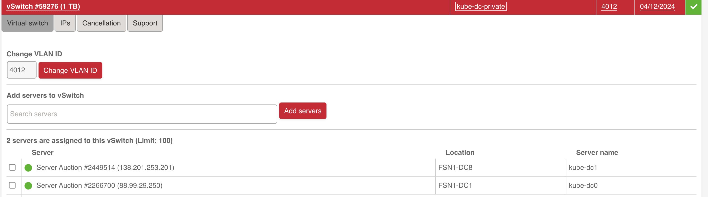
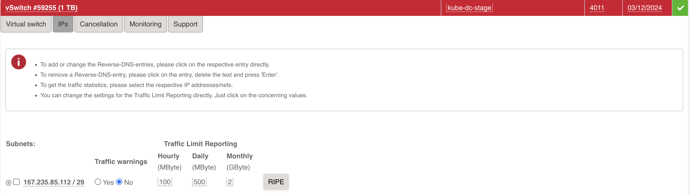

# Master-Worker Setup on Hetzner Dedicated Servers

This guide provides step-by-step instructions for deploying a Kube-DC cluster with a master and worker node setup on Hetzner Dedicated Servers. This deployment leverages Hetzner's vSwitch and additional subnets to provide enterprise-grade networking capabilities for floating IPs and load balancers.

## Prerequisites

1. At least two Hetzner Dedicated Servers
2. Access to Hetzner Robot interface
3. A Hetzner vSwitch configured for your servers (see [Hetzner vSwitch documentation](https://docs.hetzner.com/robot/dedicated-server/network/vswitch/))
4. An additional subnet allocated through Hetzner Robot for external IPs and load balancers
5. Wildcard domain ex: *.dev.kube-dc.com shoud be set to main public ip of master node.

## Server Configuration

### 1. Prepare Servers

Ensure your Hetzner Dedicated Servers meet these minimum requirements:
- **Master Node**: 4+ CPU cores, 16+ GB RAM
- **Worker Node**: 4+ CPU cores, 16+ GB RAM

Install Ubuntu 24.04 LTS on all servers through the Hetzner Robot interface.

### 2. Configure vSwitch

In the Hetzner Robot interface:

  1. Create a [vSwitch](https://robot.hetzner.com/vswitch/index) if you don't have one already
  2. Add your servers to the vSwitch
  
  3. Request an additional subnet to be used for external IPs (Floating IPs)
  4. Assign the subnet to your vSwitch:
  


You will get two vlan ids, one for the local network(in example 4012) and one for the external subnet with public ips(in example 4011).

## Network Configuration

### 1. Configure Network Interfaces

SSH into each server and configure the networking using Netplan.  
Backup default netplan config:  
```bash
mkdir /root/tmp/
mv /etc/netplan/*.yaml /root/tmp/
```
Create new config(`/etc/netplan/60-kube-dc.yaml`)  
Replace values with `example` by values from default file(see it in `/root/tmp/`):

```yaml
network:
  version: 2
  renderer: networkd
  ethernets:
    enp0s31f6_example:  # Primary network interface name (get it from default netplan config)
      addresses:
        - 22.22.22.2_example/24  # Primary IP address and subnet mask (get it from default netplan config)
      routes:
        - to: 0.0.0.0/0  # Default route for all traffic
          via: 22.22.22.1_example  # Gateway IP address (get it from default netplan config)
          on-link: true  # Indicates the gateway is directly reachable
          metric: 100  # Route priority (lower = higher priority)
      routing-policy:
        - from: 22.22.22.2_example  # Source-based routing for traffic from gateway (Primary IP)
          table: 100  # Custom routing table ID
      nameservers:
        addresses:
          - 8.8.8.8  # Primary DNS server (Google)
          - 8.8.4.4  # Secondary DNS server (Google)
  vlans:
    enp0s31f6.4012_example:  # VLAN interface name (format: interface.vlan_id, see your VLAN in https://robot.hetzner.com/vswitch/index)
      id: 4012_example  # VLAN ID (must match your Hetzner vSwitch ID, same vlan_id)
      link: enp0s31f6_example  # Parent interface for VLAN (same interface from default netplan config)
      mtu: 1460  # Maximum Transmission Unit size
      addresses:
        - 192.168.100.2/22  # Master node IP on private network (This for master node setup)
       #- 192.168.100.3/22  # Worker node IP                    (This for master node setup)
```

Apply the configuration:

```bash
sudo netplan apply
```

### 2. System Optimization

Downgrade kernel (due to a bug in kernel https://github.com/k3s-io/k3s/issues/11175):

```bash
sudo apt -y update
sudo apt install linux-image-6.8.0-52-generic linux-headers-6.8.0-52-generic
# Remove previous kernel
sudo apt-get remove --purge linux-image-6.8.0-58-generic linux-headers-6.8.0-58-generic
# Reboot
sudo reboot

```

On all nodes, update, upgrade, and install required software:

```bash
sudo apt -y install unzip iptables linux-headers-$(uname -r)
```

Update to the latest kernel version:

```bash
sudo apt -y install linux-generic
sudo reboot
```

After the server reboots, verify your kernel version:

```bash
uname -r
```

Optimize system settings by adding to `/etc/sysctl.conf`:

```bash
# Increase inotify limits
fs.inotify.max_user_watches=1524288
fs.inotify.max_user_instances=4024

# Enable packet forwarding
net.ipv4.ip_forward = 1
```

Ensure the nf_conntrack module is loaded:

```bash
# Check if the module is loaded
lsmod | grep nf_conntrack

# If not loaded, load it manually
sudo modprobe nf_conntrack

# To ensure it's loaded on boot, add it to /etc/modules
echo "nf_conntrack" | sudo tee -a /etc/modules
```

Apply the changes:

```bash
sudo sysctl -p
```

Disable systemd-resolved to prevent DNS conflicts:

```bash
sudo systemctl stop systemd-resolved
sudo systemctl disable systemd-resolved
sudo rm /etc/resolv.conf
echo "nameserver 8.8.8.8" | sudo tee /etc/resolv.conf
echo "nameserver 8.8.4.4" | sudo tee -a /etc/resolv.conf
```

Update the hosts file on each server with the private IPs:

```bash
# On Master Node
echo "192.168.100.2 kube-dc-master-1" | sudo tee -a /etc/hosts
# On Worker Node
echo "192.168.100.3 kube-dc-worker-1" | sudo tee -a /etc/hosts
```

## Kubernetes Installation

### 1. Install Cluster.dev

On the master node, install Cluster.dev:

```bash
curl -fsSL https://raw.githubusercontent.com/shalb/cluster.dev/master/scripts/get_cdev.sh | sh
```


### 2. Configure and Install RKE2 on Master Node

Install kubectl:

```bash
curl -LO "https://dl.k8s.io/release/$(curl -L -s https://dl.k8s.io/release/stable.txt)/bin/linux/amd64/kubectl"
chmod +x kubectl
sudo mv kubectl /usr/local/bin/
```

Create RKE2 configuration (replace the external IP with your server's public IP):

```bash
sudo mkdir -p /etc/rancher/rke2/

cat <<EOF | sudo tee /etc/rancher/rke2/config.yaml
node-name: kube-dc-master-1
disable-cloud-controller: true
disable: rke2-ingress-nginx
cni: none
cluster-cidr: "10.100.0.0/16"
service-cidr: "10.101.0.0/16"
cluster-dns: "10.101.0.11"
node-label:
  - kube-dc-manager=true
  - kube-ovn/role=master
kube-apiserver-arg: 
  - authentication-config=/etc/rancher/auth-conf.yaml
debug: true
node-external-ip: 22.22.22.2_example # Primary IP address (get it from default netplan config)
tls-san:
  - kube-api.yourdomain.com
  - 192.168.100.2 # Master node IP on private network (This for master node setup)
advertise-address: 192.168.100.2 # Master node IP on private network (This for master node setup)
node-ip: 192.168.100.2 # Master node IP on private network (This for master node setup)
EOF

cat <<EOF | sudo tee /etc/rancher/auth-conf.yaml
apiVersion: apiserver.config.k8s.io/v1beta1
kind: AuthenticationConfiguration
jwt: []
EOF
sudo chmod 666 /etc/rancher/auth-conf.yaml
```

Install RKE2 server:

```bash
export INSTALL_RKE2_VERSION="v1.32.1+rke2r1"
export INSTALL_RKE2_TYPE="server"
curl -sfL https://get.rke2.io | sh -
sudo systemctl enable rke2-server.service
sudo systemctl start rke2-server.service
```

You can check the installation logs here:

```bash
sudo journalctl -u rke2-server -f
```

Configure kubectl:

```bash
mkdir -p ~/.kube
sudo cp /etc/rancher/rke2/rke2.yaml ~/.kube/config
sudo chown $(id -u):$(id -g) ~/.kube/config
chmod 600 ~/.kube/config
```

Verify the cluster status:

```bash
kubectl get nodes
# If you see this output then you can proceed:
NAME               STATUS     ROLES
kube-dc-master-1   NotReady   control-plane,etcd,master
```

### 4. Join Worker Node to the Cluster

Get the join token from the master node:

```bash
# on master node
sudo cat /var/lib/rancher/rke2/server/node-token
```

On the worker node, create the RKE2 configuration (replace TOKEN with the token from the master node):

```bash
# on worker node
sudo mkdir -p /etc/rancher/rke2/

cat <<EOF | sudo tee /etc/rancher/rke2/config.yaml
token: <TOKEN>
server: https://192.168.100.2:9345 # Master node local IP
node-name: kube-dc-worker-1
node-ip: 192.168.100.3
EOF
```

Install RKE2 agent:

```bash
# on worker node
export INSTALL_RKE2_VERSION="v1.32.1+rke2r1"
export INSTALL_RKE2_TYPE="agent"
curl -sfL https://get.rke2.io | sh -
sudo systemctl enable rke2-agent.service
sudo systemctl start rke2-agent.service
```

Monitor the agent service:

```bash
# on worker node
sudo journalctl -u rke2-agent -f
```

Verify on the master node that the worker joined successfully:

```bash
# on master node
kubectl get nodes
```

## Install Kube-DC Components on Master Node

### 1. Create Cluster.dev Project Configuration

On the master node, create a project configuration file:

```bash
mkdir -p ~/kube-dc-hetzner
cat <<EOF > ~/kube-dc-hetzner/project.yaml
kind: Project
name: kube-dc-hetzner
backend: "default"
variables:
  kubeconfig: ~/.kube/config
  debug: true
EOF
```

### 2. Create Cluster.dev Stack Configuration

Create the stack configuration file(replace `example` by appropriate values):

```bash
cat <<EOF > ~/kube-dc-hetzner/stack.yaml
name: cluster
template: https://github.com/kube-dc/kube-dc-public//installer/kube-dc/templates/kube-dc?ref=main
kind: Stack
backend: default
variables:
  debug: "true"
  kubeconfig: /root/.kube/config # Change for your username path to RKE kubeconfig

  cluster_config:
    pod_cidr: "10.100.0.0/16"
    svc_cidr: "10.101.0.0/16"
    join_cidr: "100.64.0.0/16"
    cluster_dns: "10.101.0.11"
    default_external_network:
      nodes_list: # list of nodes, where 4011 vlan (external network) is accessible
        - kube-dc-master-1
        - kube-dc-worker-1
      name: external4011_example # VLAN interface for this name you can find here https://robot.hetzner.com/vswitch/index
      vlan_id: "4011_example" # VLAN interface id, see your VLAN in https://robot.hetzner.com/vswitch/index
      interface: "enp0s31f6_example" # Parent interface for VLAN (same interface from default netplan config)
      cidr: "33.33.33.33_example/29" # External subnet provided by Hetzner (should see during VLAN creation here https://robot.hetzner.com/vswitch/index)
      gateway: 33.33.33.34_example # Gateway for external subnet (should see during VLAN creation here https://robot.hetzner.com/vswitch/index)
      mtu: "1400"
    
  node_external_ip: 22.22.22.2_example # Primary IP address (get it from default netplan config). Wildcard *.dev.kube-dc.com shoud be faced on this ip


  email: "noreply@example.com"
  domain: "dev.example-kube-dc.com"
  install_terraform: true

  create_default:
    organization:
      name: example
      description: "My test org my-org 1"
      email: "example@example.com"
    project:
      name: demo
      cidr_block: "10.1.0.0/16"

  monitoring:
    prom_storage: 20Gi
    retention_size: 17GiB
    retention: 365d

  versions:
    kube_dc: "v0.1.21" # release version
EOF
```

### 3. Deploy Kube-DC

Run Cluster.dev to deploy Kube-DC components:

```bash
cd ~/kube-dc-hetzner
cdev apply
```

This process will take 15-20 minutes to complete. You can monitor the deployment progress in the terminal output.

### 4. Verify Installation

After successful deployment, you will receive console and login credentials for deployment admin user.
Also if you have created some default organization youll get organization admin credentials. Example:

```bash
keycloak_user = admin
organization_admin_username = admin
organization_name = example
project_name = demo
retrieve_organization_password = kubectl get secret realm-access -n example -o jsonpath='{.data.password}' | base64 -d
retrieve_organization_realm_url = kubectl get secret realm-access -n example -o jsonpath='{.data.url}' | base64 -d
console_url = https://console.dev.kube-dc.com
keycloak_password = XXXXXXXX
keycloak_url = https://login.dev.kube-dc.com
```

## Post-Installation Steps

### 1. Access Kube-DC UI using default organization credentials

After the installation completes, the Kube-DC UI should be accessible at `https://console.yourdomain.com`.
In cdev output there are output for default organization, project and admin user for default organization(use `retrieve_organization_password` to login):

```bash
console_url = https://console.dev.kube-dc.com
organization_admin_username = admin
organization_name = example
project_name = demo
retrieve_organization_password = kubectl get secret realm-access -n example -o jsonpath='{.data.password}' | base64 -d
retrieve_organization_realm_url = kubectl get secret realm-access -n example -o jsonpath='{.data.url}' | base64 -d
```

### 2. Keep credentials for Keycloak master admin user

You can save global Keycloak credentials if you need to manage Keycloak as super-admin.

Master admin user credentials:

```bash
keycloak_user = admin
keycloak_password = XXXXXXXX
keycloak_url = https://login.dev.kube-dc.com
```

## Troubleshooting

If you encounter issues during the installation:

1. Check the RKE2 server/agent logs:
   ```bash
   sudo journalctl -u rke2-server -f  # On master
   sudo journalctl -u rke2-agent -f   # On worker
   ```

2. Check the Kube-OVN logs:
   ```bash
   kubectl logs -n kube-system -l app=kube-ovn-controller
   ```

3. Verify network connectivity between nodes on the private network:
   ```bash
   ping 192.168.100.2  # From worker node
   ping 192.168.100.3  # From master node
   ```

For additional help, consult the [Kube-DC community support](community-support.md) resources.
