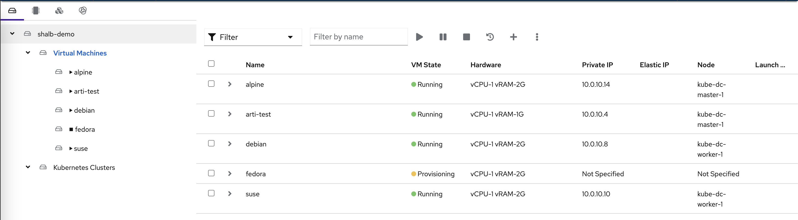
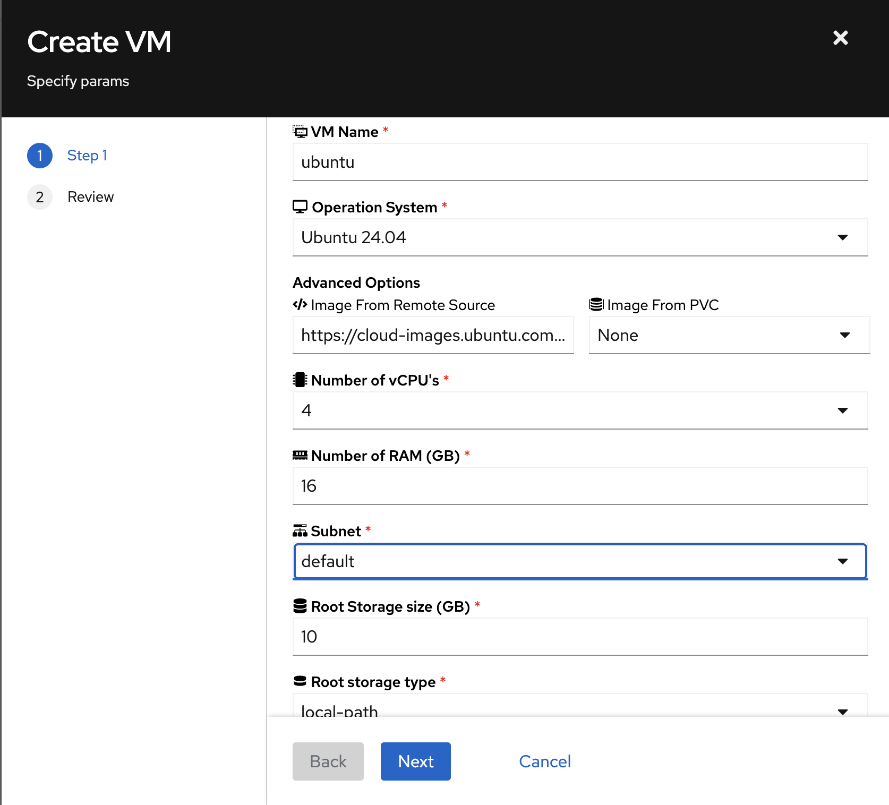
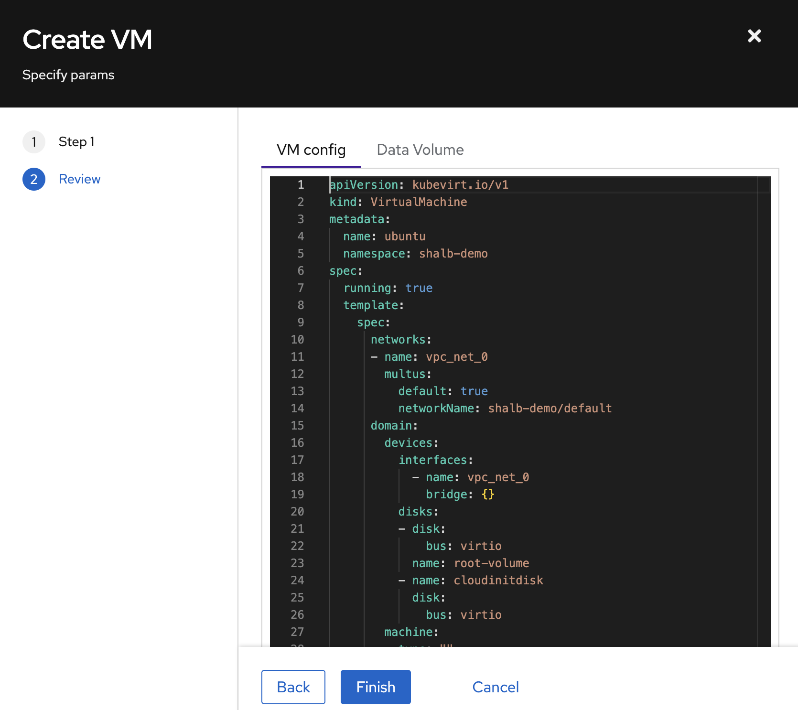
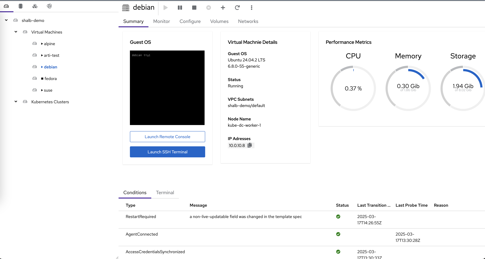

# Deploying VMs & Containers

This tutorial walks you through deploying virtual machines and containers in Kube-DC. You'll learn both the UI-based approach and how to use kubectl with YAML manifests.

## Prerequisites

Before starting this tutorial, ensure you have:

- Access to a Kube-DC cluster
- The `kubectl` command-line tool installed
- The `virtctl` plugin installed for KubeVirt (optional, but recommended)
- A project with the necessary permissions to create VMs and containers

## Understanding VM Components in Kube-DC

Kube-DC's virtualization is powered by KubeVirt and consists of several components:

1. **VirtualMachine (VM)**: Defines the VM configuration and lifecycle
2. **DataVolume**: Manages the VM's disk image(s)
3. **VirtualMachineInstance (VMI)**: Represents a running instance of a VM

## Creating a VM Using the Kube-DC UI

### Step 1: Navigate to VM Creation

1. Log in to the Kube-DC dashboard
2. Select your project from the dropdown menu (e.g., "demo")
3. Navigate to "Virtual Machines" in the left sidebar
4. Click the "+" button to create a new VM



### Step 2: Configure Basic VM Parameters

In the VM creation wizard, specify the basic parameters:

1. **VM Name**: Enter a name for your VM (e.g., "new-vm-name")
2. **Operation System**: Select from the dropdown (e.g., "Ubuntu 24.04")
3. **Advanced Options**: Expand this section if you want to customize the image source



### Step 3: Configure VM Resources

Continue configuring the VM:

1. **Number of vCPUs**: Select the number of virtual CPUs
2. **RAM (GB)**: Specify the amount of memory
3. **Subnet**: Choose the network for your VM
4. **Root Storage Size (GB)**: Set the disk size
5. **Root Storage Type**: Select the storage class

### Step 4: Review and Create

1. Click "Next" to proceed to the review page
2. Review the generated VM configuration
3. The UI shows the actual YAML that will be applied
4. Click "Finish" to create the VM



### Step 5: Monitor VM Creation

After creation:

1. You'll be redirected to the VM list
2. Wait for the VM to reach "Running" state
3. Note the assigned IP address

## Managing VMs via the UI

### Viewing VM Details

Click on a VM name to view its details page, which includes:

1. **Guest OS**: Information about the operating system
2. **VM Details**: Status, VPC subnet, and node placement
3. **Performance Metrics**: Real-time CPU, memory, and storage usage
4. **Conditions**: Agent connection and other status indicators



### Accessing VM Console

From the VM details page, you have two options:

1. **Launch Remote Console**: Opens a graphical console in your browser
2. **Launch SSH Terminal**: Opens a web-based SSH terminal

These options provide direct access to your VM without requiring SSH client configuration.

### VM Actions

The UI supports common VM management actions:

- **Start/Stop**: Control the VM power state
- **Restart**: Reboot the VM
- **Delete**: Remove the VM and its resources
- **Configure**: Modify VM settings

## Creating a VM Using kubectl Manifests

For automation or GitOps workflows, you can create VMs using kubectl and YAML manifests.

### Step 1: Create DataVolume

First, create a DataVolume to serve as the VM's disk:

```yaml
apiVersion: cdi.kubevirt.io/v1beta1
kind: DataVolume
metadata:
  name: ubuntu-vm-disk
  namespace: shalb-demo
spec:
  pvc:
    accessModes:
    - ReadWriteOnce
    resources:
      requests:
        storage: 10G
    storageClassName: local-path
  source:
    http:
      url: https://cloud-images.ubuntu.com/noble/current/noble-server-cloudimg-amd64.img
```

Apply this manifest:

```bash
kubectl apply -f ubuntu-datavolume.yaml
```

### Step 2: Create the VM Definition

Create a VM manifest:

```yaml
apiVersion: kubevirt.io/v1
kind: VirtualMachine
metadata:
  name: ubuntu-vm
  namespace: shalb-demo
spec:
  running: true
  template:
    spec:
      networks:
      - name: vpc_net_0
        multus:
          default: true
          networkName: shalb-demo/default
      domain:
        devices:
          interfaces:
            - name: vpc_net_0
              bridge: {}
          disks:
          - disk: 
              bus: virtio
            name: root-volume
          - name: cloudinitdisk
            disk:
              bus: virtio
        cpu:
          cores: 2
        memory:
          guest: 4G
      volumes:
      - dataVolume:
          name: ubuntu-vm-disk
        name: root-volume
      - name: cloudinitdisk
        cloudInitNoCloud:
          userData: |-
            #cloud-config
            chpasswd: { expire: False }
            password: temppassword
            ssh_pwauth: True
            package_update: true
            package_upgrade: true
            packages:
            - qemu-guest-agent
            runcmd:
            - [ systemctl, enable, qemu-guest-agent ]
            - [ systemctl, start, qemu-guest-agent ]
```

Apply the VM manifest:

```bash
kubectl apply -f ubuntu-vm.yaml
```

### Step 3: Monitor VM Status

Check the status of your VM:

```bash
kubectl get virtualmachines -n shalb-demo
kubectl get virtualmachineinstances -n shalb-demo
```

## VM Examples for Different Operating Systems

Kube-DC supports various operating systems. Here are examples for the most common ones:

### Debian

```yaml
apiVersion: cdi.kubevirt.io/v1beta1
kind: DataVolume
metadata:
  name: debian-base-img
spec:
  pvc:
    accessModes:
    - ReadWriteOnce
    resources:
      requests:
        storage: 14G
    storageClassName: local-path
  source:
    http:
      url: https://cloud.debian.org/images/cloud/bookworm/latest/debian-12-generic-amd64.qcow2
---
apiVersion: kubevirt.io/v1
kind: VirtualMachine
metadata:
  name: debian-vm
  namespace: shalb-demo
spec:
  running: true
  template:
    spec:
      networks:
      - name: vpc_net_0
        multus:
          default: true
          networkName: shalb-demo/default
      domain:
        devices:
          interfaces:
            - name: vpc_net_0
              bridge: {}
          disks:
          - disk: 
              bus: virtio
            name: root-volume
          - name: cloudinitdisk
            disk:
              bus: virtio
        cpu:
          cores: 1
        memory:
          guest: 2G
      volumes:
      - dataVolume:
          name: debian-base-img
        name: root-volume
      - name: cloudinitdisk
        cloudInitNoCloud:
          userData: |-
            #cloud-config
            chpasswd: { expire: False }
            password: temppassword
            ssh_pwauth: True
            package_update: true
            packages:
            - qemu-guest-agent
            runcmd:
            - [ systemctl, start, qemu-guest-agent ]
```

### Alpine Linux

```yaml
apiVersion: cdi.kubevirt.io/v1beta1
kind: DataVolume
metadata:
  name: alpine-base-img
spec:
  pvc:
    accessModes:
    - ReadWriteOnce
    resources:
      requests:
        storage: 2G
    storageClassName: local-path
  source:
    http:
      url: https://dl-cdn.alpinelinux.org/alpine/v3.19/releases/cloud/nocloud_alpine-3.19.1-x86_64-bios-cloudinit-r0.qcow2
```

### CentOS 8

```yaml
apiVersion: cdi.kubevirt.io/v1beta1
kind: DataVolume
metadata:
  name: centos-base-img
spec:
  pvc:
    accessModes:
    - ReadWriteOnce
    resources:
      requests:
        storage: 10G
    storageClassName: local-path
  source:
    http:
      url: https://cloud.centos.org/centos/8-stream/x86_64/images/CentOS-Stream-GenericCloud-8-20230710.0.x86_64.qcow2
```

## Virtual Machine Health Checks

Kube-DC supports VM health checks to ensure your VMs are running properly:

```yaml
spec:
  template:
    spec:
      readinessProbe:
        guestAgentPing: {}
        failureThreshold: 10
        initialDelaySeconds: 20
        periodSeconds: 10
        timeoutSeconds: 5
      livenessProbe:
        failureThreshold: 10
        initialDelaySeconds: 120
        periodSeconds: 20
        timeoutSeconds: 5
        httpGet:
          port: 80
```

## Exposing VM Services

### Creating a Service for VM

To expose a service running on your VM:

```yaml
apiVersion: v1
kind: Service
metadata:
  name: vm-ssh-service
  namespace: shalb-demo
  annotations:
    service.nlb.kube-dc.com/bind-on-default-gw-eip: "true"
spec:
  type: LoadBalancer
  selector:
    vm.kubevirt.io/name: ubuntu-vm
  ports:
    - name: ssh
      protocol: TCP
      port: 2222
      targetPort: 22
```

Apply this service:

```bash
kubectl apply -f vm-service.yaml
```

## Using Floating IPs for VMs

You can assign a floating IP to your VM for direct external access:

```yaml
apiVersion: kube-dc.com/v1
kind: FIp
metadata:
  name: ubuntu-vm-fip
  namespace: shalb-demo
spec:
  ipAddress: 10.0.10.171
  eip: vm-eip
```

First, ensure you have an EIP:

```yaml
apiVersion: kube-dc.com/v1
kind: EIp
metadata:
  name: vm-eip
  namespace: shalb-demo
spec: {}
```

## Deploying Containers Alongside VMs

Kube-DC allows you to run containers alongside VMs. Here's how to deploy a simple Nginx container:

```yaml
apiVersion: apps/v1
kind: Deployment
metadata:
  name: nginx
  namespace: shalb-demo
spec:
  replicas: 2
  selector:
    matchLabels:
      app: nginx
  template:
    metadata:
      labels:
        app: nginx
    spec:
      containers:
      - name: nginx
        image: nginx:latest
        ports:
        - containerPort: 80
        resources:
          requests:
            memory: "64Mi"
            cpu: "250m"
          limits:
            memory: "128Mi"
            cpu: "500m"
```

Create a service for the Nginx deployment:

```yaml
apiVersion: v1
kind: Service
metadata:
  name: nginx-service
  namespace: shalb-demo
  annotations:
    service.nlb.kube-dc.com/bind-on-default-gw-eip: "true"
spec:
  type: LoadBalancer
  selector:
    app: nginx
  ports:
  - port: 80
    targetPort: 80
```

## Best Practices for VM Management

### Resource Allocation

- Allocate appropriate resources based on the OS and workload requirements
- Monitor VM performance to adjust resources as needed
- Use resource quotas to prevent resource exhaustion

### Security

- Change default passwords immediately
- Use SSH keys instead of passwords when possible
- Keep guest OS updated with security patches
- Apply network policies to control VM traffic

### Efficiency

- Use cloud-init for automated VM configuration
- Create VM templates for standardized deployments
- Use the smallest OS image that meets your requirements

## Troubleshooting VMs

### Common Issues

1. **VM stuck in provisioning**: Check DataVolume status and events
   ```bash
   kubectl get datavolume -n shalb-demo
   kubectl describe datavolume ubuntu-vm-disk -n shalb-demo
   ```

2. **VM not accessible via network**: Verify network configuration
   ```bash
   kubectl get vmi -n shalb-demo -o jsonpath='{.items[*].status.interfaces[*].ipAddress}'
   ```

3. **Cloud-init not running**: Check cloud-init logs inside the VM
   ```bash
   # Inside the VM
   sudo cat /var/log/cloud-init.log
   ```

### Accessing VM Logs

```bash
kubectl get events -n shalb-demo
virtctl console ubuntu-vm -n shalb-demo
virtctl logs ubuntu-vm -n shalb-demo
```

## Advanced KubeVirt Features

For more advanced features, refer to the [KubeVirt documentation](https://kubevirt.io/user-guide/):

- [VM Snapshots](https://kubevirt.io/user-guide/operations/snapshot_restore_api/)
- [Live Migration](https://kubevirt.io/user-guide/operations/live_migration/)
- [GPU Passthrough](https://kubevirt.io/user-guide/virtual_machines/host-devices/)
- [Storage Management](https://kubevirt.io/user-guide/virtual_machines/disks_and_volumes/)

## Conclusion

You've now learned how to deploy and manage VMs and containers in Kube-DC using both the intuitive UI and kubectl manifests. This hybrid approach allows you to choose the most appropriate method for your workflow, whether you prefer interactive management or automation through GitOps practices.
