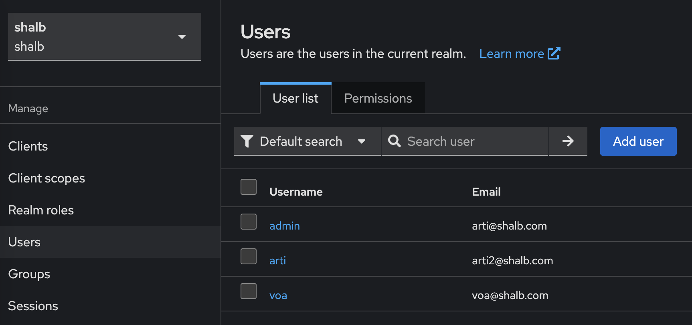
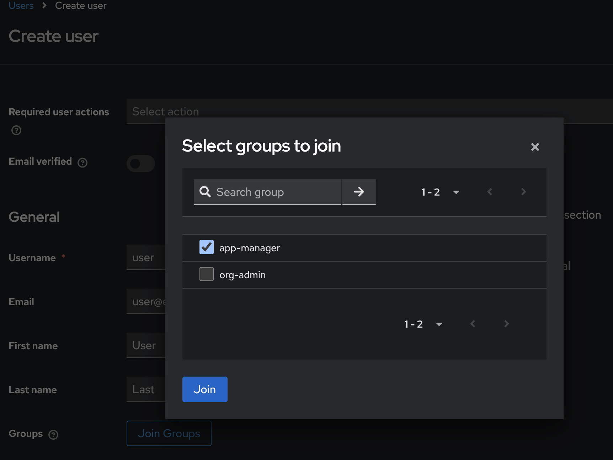

# User and Group Management

This guide explains how to set up and manage users, groups, and roles in Kube-DC using Kubernetes RBAC and Keycloak integration.

<!-- 
??? note "TODO: Items to Complete"
    - [ ] Add doc on retrieving Organization Admin kubeconfig
    - [ ] Add example YAML for full-access role
    - [ ] Add example YAML for read-only role
    - [ ] Add example YAML for k8s-user role
    - [ ] Add example YAML for vm-user role
    - [ ] Add troubleshooting section for common permission issues
    - [ ] Document how to revoke user access
    - [ ] Create section on auditing user activities
-->


## Overview

Kube-DC implements a multi-tenant access control system that combines:

- **Kubernetes RBAC**: Handles resource-level permissions within namespaces
- **Organization Groups**: Manages project-level access across namespaces
- **Keycloak Integration**: Provides user authentication and group management

## Standard Roles

Kube-DC automatically creates standard roles when organizations and projects are provisioned. These provide a baseline permission structure that can be extended with custom roles.

### Organization-Level Roles

| Role | Group | Permissions |
|------|-------|-------------|
| `{org}-admin` | `org-admin` | Full CRUD on organizations, projects, organizationgroups |
| `{org}-user` | `user` | Read-only access to organization and projects list |

### Project-Level Roles

| Role | Description | Key Permissions |
|------|-------------|-----------------|
| `admin` | Full project access | All resources: `*` verbs, RBAC management |
| `developer` | VM/workload management | VMs, pods, services: full CRUD; secrets: read-only; no RBAC |
| `project-manager` | View + console access | All resources: get, list, watch; VM console/VNC access |
| `user` | Read-only access | All resources: get, list; no console, no secrets |

### Automatic Role Bindings

When a project is created, the following bindings are automatically configured:

| RoleBinding | Subject | Role | Purpose |
|-------------|---------|------|---------|
| `org-admin` | `{org}:org-admin` | `admin` | Org admins get full project access |
| `user` | `{org}:user` | `user` | All org users get read-only access |

### Assigning Elevated Access

To grant users elevated access (developer or project-manager roles), create an OrganizationGroup:

```yaml
apiVersion: kube-dc.com/v1
kind: OrganizationGroup
metadata:
  name: dev-team
  namespace: shalb  # organization namespace
spec:
  permissions:
  - project: demo
    roles:
    - developer  # grants developer role in shalb-demo project
```

This creates a Keycloak group `dev-team`. Add users to this group in Keycloak to grant them developer access to the specified project.

## Prerequisites

This guide assumes you're working from an **Organization Admin** perspective. You'll need:

- Access to the Kube-DC cluster with organization admin privileges
- `kubectl` configured to access your cluster with organization admin privileges
- Access to the Keycloak organization admin console

!!! tip "Before You Begin"
    During organization and project creation you will get a namespace with organization name `<orgname>` created and project namespace with `<orgname>-<projectname>` pattern.

## Step-by-Step Guide

### Creating Custom Project Roles

While Kube-DC provides standard roles (`admin`, `developer`, `project-manager`, `user`) that cover most use cases, you can create custom Kubernetes Roles for specialized permission requirements.

!!! note "When to Use Custom Roles"
    Custom roles are useful when:
    
    - You need permissions not covered by standard roles
    - You want to restrict access to specific resource types
    - You need fine-grained control over particular workloads

**Example: Custom role for managing deployments and services**

```yaml
apiVersion: rbac.k8s.io/v1
kind: Role
metadata:
  namespace: shalb-demo  # Replace with your project namespace
  name: deployment-manager  # Custom role name
rules:
  - apiGroups: [""]  # "" indicates the core API group
    resources: ["pods", "services"]
    verbs: ["get", "list", "create", "watch", "delete"]
  - apiGroups: ["apps"]
    resources: ["deployments", "daemonsets", "replicasets"]
    verbs: ["get", "list", "create", "watch", "delete"]
```

Apply the custom role:

```bash
kubectl apply -f custom-role.yaml
```

!!! warning "Role Scope"
    Roles are namespace-scoped. If you need permissions across multiple namespaces, create the Role in each project namespace or reference it via OrganizationGroup.

### Creating Organization Groups

Create an OrganizationGroup Custom Resource (CR) to define group permissions across projects.

!!! important "Key Points"
    - The OrganizationGroup CR automatically creates a corresponding group in Keycloak
    - This CR **must be created in the organization namespace**, not the project namespace
    - Role bindings would be created by this CR

```yaml
apiVersion: kube-dc.com/v1
kind: OrganizationGroup
metadata:
  name: "app-manager"
  namespace: shalb  # namespace of the organization (not the project)
spec:
  permissions:
  - project: "demo"
    roles:
    - developer  # standard role, or use custom role name like 'deployment-manager'
  # Additional projects and roles can be added:
  # - project: "prod"
  #   roles:
  #   - project-manager
```

Apply the group configuration:

```bash
kubectl apply -f organization-group.yaml
```

### Managing Users in Keycloak

#### Access Keycloak Admin Console

Retrieve Keycloak access credentials from your organization namespace:

```bash
kubectl get secret realm-access -n shalb -o jsonpath='{.data.url}' | base64 -d
kubectl get secret realm-access -n shalb -o jsonpath='{.data.user}' | base64 -d
kubectl get secret realm-access -n shalb -o jsonpath='{.data.password}' | base64 -d
```

!!! tip "Remember"
    Replace `shalb` with your own organization namespace in the commands above.

#### Create and Configure Users

1. Log in to the Keycloak admin console using the retrieved credentials
2. Navigate to **Users → Add User**

3. Fill in the required user information
4. Set up initial password in the **Credentials** tab
5. Add the user to the appropriate group (e.g., "app-manager") via the **Groups** tab


!!! info "User Group Mapping"
    Any groups created via OrganizationGroup CRs will appear automatically in Keycloak. Changes to group membership in Keycloak are synchronized with Kubernetes RBAC.

### Accessing Kube-DC UI

1. Navigate to the Kube-DC UI login page
2. Log in using the credentials created in Keycloak
3. Verify access to assigned project resources

!!! tip "Permissions Troubleshooting"
    If a user cannot access expected resources:
    - Verify they're assigned to the correct groups in Keycloak
    - Check that the OrganizationGroup CR includes the correct projects and roles
    - Ensure the underlying Kubernetes Roles have appropriate permissions
    - Examine the Keycloak logs for authentication issues
    
    Permission changes may take up to 5 minutes to propagate through the system.


